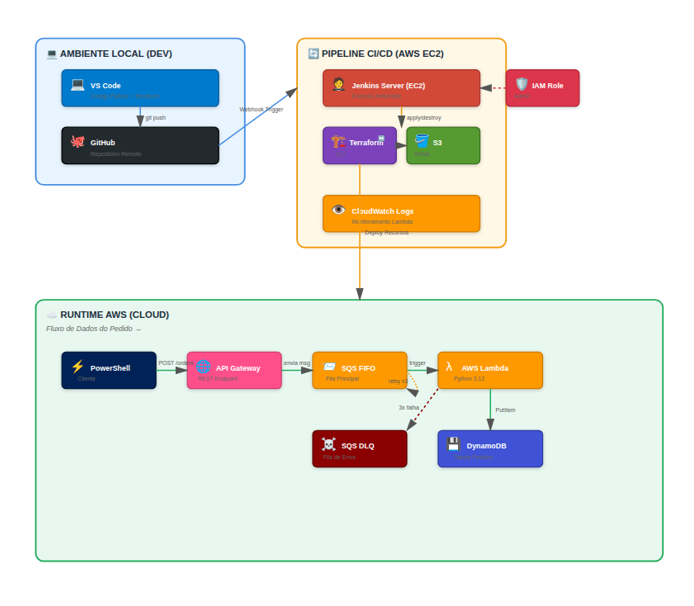
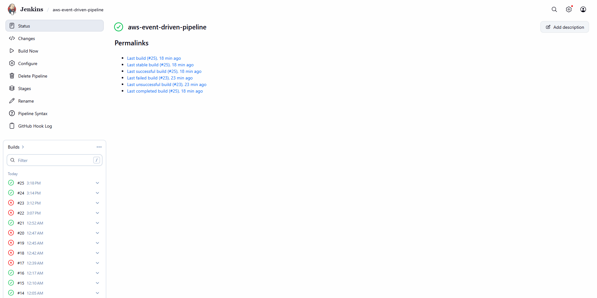
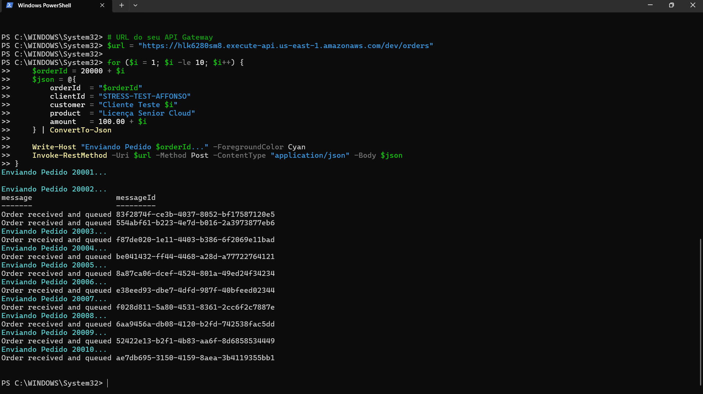
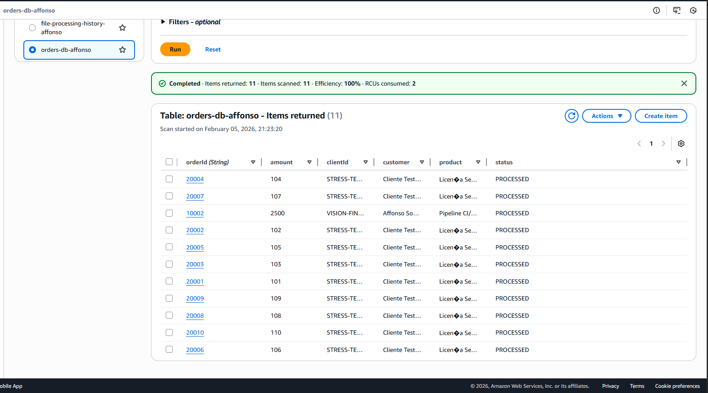

# AWS Event-Driven Pipeline: Order Processing System

## 🚀 Project Status: Success & Archived
> **Note**: This project has achieved its primary objectives and is now in an archived state. All core functionalities, including CI/CD automation, event-driven messaging, and NoSQL persistence, have been successfully validated and documented.

---

## 📌 Overview
This project implements a highly scalable, event-driven architecture on AWS to process customer orders. It demonstrates a full-cycle DevOps approach, utilizing **Infrastructure as Code (Terraform)** and **CI/CD (Jenkins)** to deploy a serverless environment.

### 🏗️ Architecture
The system follows a modern decoupled pattern:
1. **API Gateway**: Entry point for REST requests.
2. **Amazon SQS (FIFO)**: Buffers messages to ensure reliability and order.
3. **AWS Lambda**: Processes messages using Python 3.12 logic.
4. **Amazon DynamoDB**: Stores processed order data with a "PROCESSED" status.
5. **Observability**: DLQ (Dead Letter Queue) for failed messages and SNS for email notifications.

---

## 🛠️ Tech Stack
* **Cloud**: Amazon Web Services (AWS)
* **IaC**: Terraform
* **CI/CD**: Jenkins (Hosted on EC2)
* **Language**: Python (Boto3)
* **Scripting**: PowerShell for stress testing

---

## 📈 Evidence of Success

### 1. CI/CD Automation
The infrastructure was managed through a Jenkins pipeline, achieving high stability over 25 successful builds, ensuring consistent deployments and security-by-design (Secret Management).

### 2. Integration & Stress Testing
A PowerShell script was used to simulate real-world traffic, sending batch orders to the API Gateway. The system successfully handled concurrent requests and mapped them to SQS message IDs.

### 3. Data Persistence
Final validation was performed by auditing the DynamoDB table, which confirmed that all sent orders were correctly parsed, processed, and stored with their respective attributes.

---

## 🔒 Security Best Practices Implemented
* **Secret Management**: Passwords and sensitive data were handled via Jenkins Credentials and Terraform Variables, never exposed in plain text.
* **Environment Isolation**: Used Python Virtual Environments (`.venv`) and `.gitignore` to maintain a clean and secure repository.
* **IAM Least Privilege**: Lambda functions were configured with specific roles for CloudWatch, SQS, and DynamoDB.

---

**Developed by [Affonso Souza](https://github.com/imthenewSinatra)** *Cloud & DevOps Enthusiast | Data Science Student*
---

## 👨‍💻 Desenvolvido por

**Affonso Souza** *Cloud & DevOps Enthusiast*

